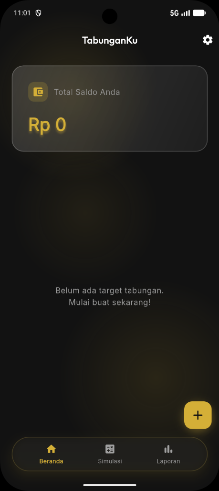
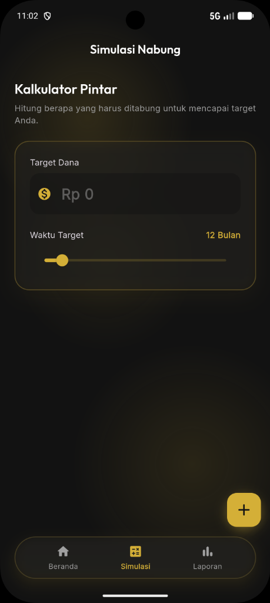
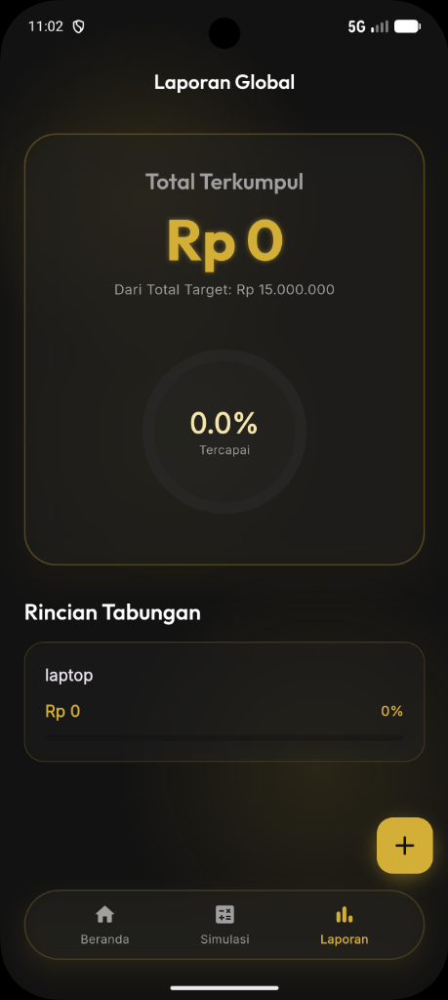

# MyTabungan

Aplikasi pencatat tabungan dengan desain Glassmorphism yang modern, responsif, dan elegan, dibuat dengan **Flutter**. Aplikasi ini membantu Anda menetapkan target keuangan, memantau riwayat tabungan, dan mensimulasikan pencapaian target di masa depan!

## ✨ Fitur Utama

* **Dashboard Visual**: Pantau total saldo terkumpul dan daftar target tabungan dengan desain kartu bercahaya ala Glassmorphism.
* **Simulasi Kalkulator Pintar**: Hitung otomatis nominal yang harus disisihkan (per bulan/minggu/hari) untuk mencapai target pada batas waktu yang diinginkan.
* **Laporan Global**: Tinjau statistik persentase tabungan Anda secara keseluruhan dan rincian progress dari tiap target.
* **Navigasi Cepat (Swipe-able)**: Transisi _swipe_ animasi 3D yang sangat *smooth* antar halaman.
* **Database Lokal Otomatis**: Data Anda tersimpan dengan aman langsung di HP Anda.

## 📸 Tampilan Layar 
Berikut ini adalah tampilan antarmuka dari aplikasi MyTabungan:

<div style="display:flex; justify-content: space-around;">
    
    
    
</div>

## 🚀 Cara Menjalankan (Developer)

1. Pastikan Anda telah menginstal **Flutter SDK**.
2. *Clone* atau unduh *repository* ini.
3. Jalankan perintah untuk mengunduh semua *dependencies*:
   ```bash
   flutter pub get
   ```
4. Hubungkan HP atau nyalakan Emulator Android/iOS Anda.
5. Jalankan aplikasi (sangat disarankan mode Release untuk performa optimal UI *Glassmorphism*):
   ```bash
   flutter run --release
   ```

---

