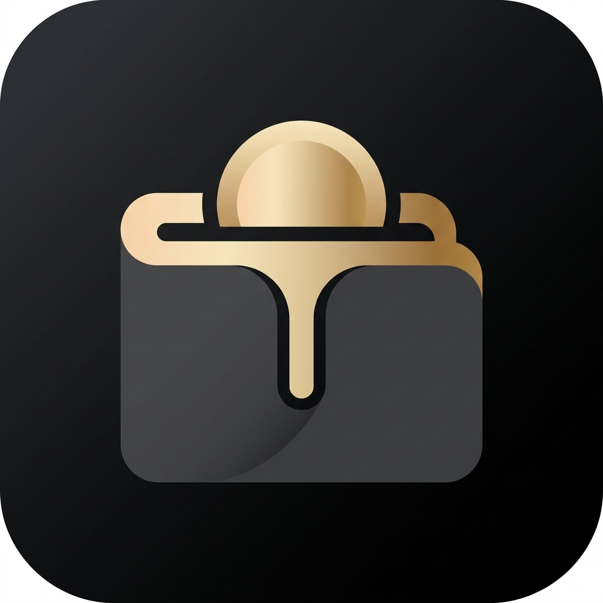

<p align="center">
  
</p>

<h1 align="center">MyTabungan</h1>

<p align="center">
  <em>Kelola masa depan finansial Anda dengan elegan.</em>
</p>

<p align="center">
  
  
  
  
  
</p>

---

## 📖 Tentang Aplikasi

**MyTabungan** adalah aplikasi pencatat & perencana tabungan pribadi dengan desain **Glassmorphism** yang mewah, dibangun menggunakan **Flutter** dan **Firebase**. Aplikasi ini membantu Anda:

- 🎯 Menetapkan target tabungan dengan deadline
- 💰 Mencatat setiap transaksi setoran & penarikan
- 📊 Memantau progress tabungan secara visual
- 🧮 Mensimulasikan berapa yang harus ditabung per hari/minggu/bulan
- 🔒 Mengamankan akses dengan autentikasi biometrik (sidik jari)

---

## 📸 Screenshot

<p align="center">
  
  &nbsp;&nbsp;&nbsp;&nbsp;
  
  &nbsp;&nbsp;&nbsp;&nbsp;
  
</p>

<p align="center">
  <sub><strong>Beranda</strong> • <strong>Simulasi</strong> • <strong>Laporan</strong></sub>
</p>

---

## ✨ Fitur Unggulan

### 🏠 MyTabungan — Beranda
- Kartu saldo total dengan efek **3D Tilt Parallax**
- Daftar target tabungan dengan desain kartu **Glassmorphism**
- Progress bar visual per target tabungan
- Countdown hari menuju target deadline
- Animasi **staggered entrance** saat membuka halaman

### 🧮 MyKalkulator — Simulasi Nabung
- Masukkan target dana dan durasi waktu
- Hitung otomatis nominal tabungan per **bulan**, **minggu**, dan **hari**
- Slider interaktif untuk mengatur durasi
- Kartu hasil dengan efek tilt 3D

### 📊 MyLaporan — Laporan Global
- **Donut chart** animasi interaktif (PieChart)
- Persentase pencapaian total dari semua target
- Rincian tabungan per target dengan progress bar
- Statistik keseluruhan keuangan Anda

### 🔐 Keamanan
- Autentikasi pengguna via **Firebase Auth** (Email & Password)
- Kunci biometrik (Fingerprint / Face ID) opsional
- Data terenkripsi dan tersimpan di **Cloud Firestore**

### 🎨 Desain & Animasi Premium
- **Dark Theme** mewah dengan aksen **Gold/Champagne**
- Efek **Glassmorphism** (blur + transparansi) di seluruh UI
- Background **Orbs Bercahaya** yang bergerak perlahan (floating ambient light)
- Animasi **staggered entrance** untuk setiap elemen halaman
- Transisi halaman **slide 3D** dengan skala dan opacity
- **Counting animation** untuk angka-angka nominal
- **Bottom Navigation Bar** transparan dengan indikator bercahaya
- Tipografi premium: **Outfit** (heading) & **Inter** (body) dari Google Fonts

---

## 🏗️ Arsitektur Proyek

```
lib/
├── main.dart                          # Entry point aplikasi
├── firebase_options.dart              # Konfigurasi Firebase
│
├── core/                              # Fondasi aplikasi
│   ├── constants/
│   │   └── app_colors.dart            # Palet warna (Gold, Dark Theme)
│   ├── theme/
│   │   └── app_theme.dart             # Material Theme kustom
│   ├── ui/
│   │   └── main_scaffold.dart         # Layout utama + PageView + Bottom Nav
│   ├── models/                        # Model data global
│   ├── repositories/                  # Repository global
│   └── utils/
│       └── hex_color.dart             # Utilitas konversi warna
│
├── features/                          # Fitur-fitur aplikasi
│   ├── auth/                          # 🔐 Autentikasi
│   │   ├── views/
│   │   │   ├── login_view.dart        # Halaman login/register
│   │   │   └── auth_checker.dart      # Router autentikasi + biometrik
│   │   └── repositories/
│   │       └── auth_repository.dart   # Firebase Auth wrapper
│   │
│   ├── savings/                       # 💰 Fitur Tabungan (inti)
│   │   ├── views/
│   │   │   ├── dashboard_view.dart    # Beranda — daftar target
│   │   │   ├── goal_detail_view.dart  # Detail target + riwayat transaksi
│   │   │   ├── report_view.dart       # Laporan global + chart
│   │   │   └── widgets/
│   │   │       ├── looping_background.dart    # Animasi orbs background
│   │   │       ├── add_goal_sheet.dart        # Form tambah target
│   │   │       ├── edit_goal_sheet.dart       # Form edit target
│   │   │       ├── add_transaction_sheet.dart # Form tambah transaksi
│   │   │       └── edit_transaction_sheet.dart# Form edit transaksi
│   │   ├── controllers/
│   │   │   └── savings_controller.dart # Riverpod state management
│   │   ├── models/
│   │   │   ├── savings_goal.dart       # Model target tabungan
│   │   │   └── transaction.dart        # Model transaksi
│   │   └── repositories/
│   │       └── savings_repository.dart # Firestore CRUD operations
│   │
│   ├── simulator/                     # 🧮 Simulasi Tabungan
│   │   └── views/
│   │       └── simulator_view.dart    # Kalkulator pintar
│   │
│   └── settings/                      # ⚙️ Pengaturan
│       ├── views/
│       │   └── settings_view.dart     # Halaman pengaturan
│       └── controllers/
│           └── settings_controller.dart
```

---

## 🛠️ Tech Stack

| Teknologi | Kegunaan |
|---|---|
| **Flutter 3.11** | Framework UI cross-platform |
| **Dart 3.11** | Bahasa pemrograman |
| **Firebase Auth** | Autentikasi pengguna |
| **Cloud Firestore** | Database NoSQL real-time |
| **Riverpod** | State management reaktif |
| **fl_chart** | Chart/grafik interaktif |
| **flutter_tilt** | Efek 3D parallax tilt |
| **Google Fonts** | Tipografi premium (Outfit, Inter) |
| **local_auth** | Autentikasi biometrik |
| **animations** | Transisi Material Motion |

---

## 🚀 Cara Menjalankan

### Prasyarat
- Flutter SDK `>= 3.11.0`
- Android Studio / VS Code
- Akun Firebase (untuk backend)
- Perangkat Android / Emulator

### Langkah-langkah

1. **Clone repository ini**
   ```bash
   git clone https://github.com/YOUR_USERNAME/tabungan_online.git
   cd tabungan_online
   ```

2. **Install dependencies**
   ```bash
   flutter pub get
   ```

3. **Konfigurasi Firebase**
   - Buat project baru di [Firebase Console](https://console.firebase.google.com/)
   - Aktifkan **Authentication** (Email/Password)
   - Aktifkan **Cloud Firestore**
   - Download `google-services.json` ke `android/app/`
   - Atau gunakan FlutterFire CLI:
     ```bash
     flutterfire configure
     ```

4. **Jalankan aplikasi**
   ```bash
   # Mode debug (untuk development)
   flutter run

   # Mode release (performa optimal — DIREKOMENDASIKAN)
   flutter run --release
   ```

5. **Build APK untuk distribusi**
   ```bash
   flutter build apk --release
   ```
   Output: `build/app/outputs/flutter-apk/app-release.apk`

---

## 🎨 Desain System

### Palet Warna

| Warna | Hex | Kegunaan |
|---|---|---|
| 🟫 Deep Black | `#121212` | Background utama |
| ⬛ Surface | `#1E1E1E` | Kartu & elemen permukaan |
| 🟡 Metallic Gold | `#D4AF37` | Aksen utama (Primary) |
| 🟨 Champagne | `#F3E5AB` | Variasi aksen (Secondary) |
| ⬜ White | `#FFFFFF` | Teks utama |
| 🔘 Gray | `#A0A0A0` | Teks sekunder |
| 🟢 Green | `#4CAF50` | Status sukses |
| 🔴 Red | `#E57373` | Status error |

### Tipografi
- **Heading**: [Outfit](https://fonts.google.com/specimen/Outfit) — Bold, modern, geometric
- **Body**: [Inter](https://fonts.google.com/specimen/Inter) — Clean, readable, versatile

---

## 📱 Versi Minimum

| Platform | Versi Minimum |
|---|---|
| Android | API 21 (Android 5.0 Lollipop) |
| iOS | iOS 12.0 |

---

## 🤝 Kontribusi

Kontribusi sangat diterima! Silakan:

1. **Fork** repository ini
2. Buat **branch** fitur baru: `git checkout -b fitur/fitur-baru`
3. **Commit** perubahan: `git commit -m 'Menambahkan fitur baru'`
4. **Push** ke branch: `git push origin fitur/fitur-baru`
5. Buat **Pull Request**

---

## 📄 Lisensi

Proyek ini dilisensikan di bawah [MIT License](LICENSE).

---

<p align="center">
  Dibuat dengan ❤️ menggunakan Flutter
  <br/>
  <strong>MyTabungan</strong> — Tabungan cerdas untuk masa depan cerah ✨
</p>
